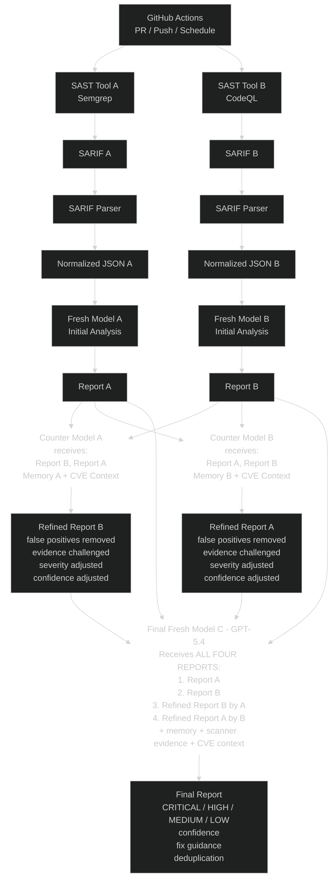

# AI-Powered SAST CI/CD Workflow

## Overview
A dual-track SAST pipeline where two independent scanners and fresh-model analyses produce reports, which are then cross-reviewed by counter-models, and finally consolidated by a third fresh model into a single deduplicated, severity-ranked report.

## Tooling

| Track | SAST Tool | Output Format |
|-------|-----------|---------------|
| A     | **Semgrep** | SARIF v2.1.0 |
| B     | **CodeQL**  | SARIF v2.1.0 |

Both scanners emit **SARIF**, which is verbose and vendor-specific. Before any AI model sees a report, it passes through a **SARIF Parser** that produces a **Normalized JSON** document with a unified schema. This guarantees Fresh Models A and B receive structurally identical input — a prerequisite for fair adversarial cross-review.

```
SAST Tool ──► SARIF ──► SARIF Parser ──► Normalized JSON ──► AI Model
```

## Pipeline Stages

1. **Trigger** — GitHub Actions on PR / Push / Schedule.
2. **Parallel Scan + Normalize** — Two independent tracks run side-by-side:
   - Track A: `Semgrep` → `SARIF` → `SARIF Parser` → `Normalized JSON A` → `Fresh Model A (Initial Analysis)` → `Report A`
   - Track B: `CodeQL` → `SARIF` → `SARIF Parser` → `Normalized JSON B` → `Fresh Model B (Initial Analysis)` → `Report B`
3. **Cross-Review (Counter Models)** — Each report is reviewed by the *opposite* track's counter model with memory + CVE context:
   - `Counter Model A` receives Report B (primary) + Report A + Memory A + CVE Context → produces `Refined Report B`
   - `Counter Model B` receives Report A (primary) + Report B + Memory B + CVE Context → produces `Refined Report A`
   - Refinement actions: false positives removed, evidence challenged, severity adjusted, confidence adjusted.
4. **Final Consolidation** — `Final Fresh Model C (GPT-5.4)` receives **all four** reports:
   1. Report A
   2. Report B
   3. Refined Report B (by A)
   4. Refined Report A (by B)
   - Plus: memory, scanner evidence, CVE context.
5. **Final Report** — CRITICAL / HIGH / MEDIUM / LOW findings with confidence, fix guidance, and deduplication.

## Diagram



## Normalized JSON Schema

The SARIF Parser flattens vendor-specific SARIF into one shape consumed by every downstream model.

```json
{
  "scan": {
    "tool": "semgrep | codeql",
    "tool_version": "x.y.z",
    "sarif_version": "2.1.0",
    "target": "repo@commit-sha",
    "scanned_at": "ISO-8601"
  },
  "findings": [
    {
      "id": "stable-fingerprint-sha256",
      "tool": "semgrep | codeql",
      "rule_id": "python.lang.security.audit.sql-injection",
      "title": "SQL Injection",
      "severity": "critical | high | medium | low | info",
      "cwe": ["CWE-89"],
      "owasp": ["A03:2021"],
      "location": {
        "file": "src/db.py",
        "start_line": 42,
        "end_line": 45,
        "snippet": "cursor.execute(f\"SELECT * FROM u WHERE id={uid}\")"
      },
      "message": "User input flows into SQL query without sanitization.",
      "data_flow": [
        {"file": "src/api.py", "line": 10, "role": "source"},
        {"file": "src/db.py",  "line": 42, "role": "sink"}
      ],
      "fingerprint": "sha256(tool|rule_id|file|normalized_snippet)",
      "raw_ref": "sarif://runs[0]/results[12]"
    }
  ]
}
```

**Normalization rules:**
- **Severity unification** — Semgrep `ERROR/WARNING/INFO` + CodeQL `error/warning/note` (with `security-severity` CVSS when present) collapse into a single 5-level scale.
- **Stable fingerprint** — `sha256(tool + rule_id + file + normalized_snippet)` enables Model C to dedupe across tracks.
- **Flat data flow** — CodeQL `codeFlows[].threadFlows[].locations[]` collapses into a flat ordered list with `source / step / sink` roles. Semgrep findings without taint trace get an empty list.
- **CWE / OWASP extraction** — pulled from `rule.properties.tags`, `rule.properties.security-severity`, and `rule.helpUri`.
- **`raw_ref` retained** — counter models can fetch the original SARIF node when challenging evidence, so normalization is lossy *for prompts* but never *for audit*.

## Key Design Notes
- **Adversarial cross-review**: Each track's report is challenged by the *other* track's counter model to reduce single-tool bias and false positives.
- **Memory + CVE context**: Counter models and the final model are grounded with prior memory and live CVE intelligence.
- **Quad-input consolidation**: The final model sees both raw and refined reports, so it can weigh refinements against original evidence rather than blindly trusting either.
- **Output discipline**: Final report enforces severity buckets, confidence scores, fix guidance, and deduplication.
- **SARIF normalization**: Both tracks emit SARIF, then a parser produces identically-shaped Normalized JSON. This removes vendor bias from prompts, cuts token cost vs. raw SARIF, and makes Model A vs. Model B a true apples-to-apples comparison.