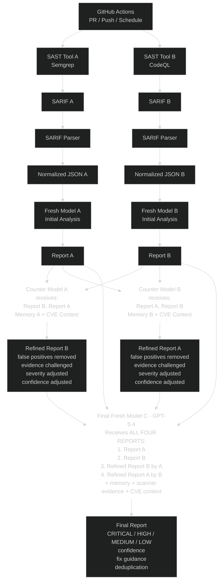

# AI-Powered SAST CI/CD Workflow

## Overview
A dual-track SAST pipeline where two independent scanners and fresh-model analyses produce reports, which are then cross-reviewed by counter-models, and finally consolidated by a third fresh model into a single deduplicated, severity-ranked report.

## Tooling

| Track | SAST Tool | Output Format |
|-------|-----------|---------------|
| A     | **Semgrep** | SARIF v2.1.0 |
| B     | **CodeQL**  | SARIF v2.1.0 |

Both scanners emit **SARIF**, which is verbose and vendor-specific. Before any AI model sees a report, it passes through a **SARIF Parser** that produces a **Normalized JSON** document with a unified schema. This guarantees Fresh Models A and B receive structurally identical input — a prerequisite for fair adversarial cross-review.

```
SAST Tool ──► SARIF ──► SARIF Parser ──► Normalized JSON ──► AI Model
```

## Pipeline Stages

1. **Trigger** — GitHub Actions on PR / Push / Schedule.
2. **Parallel Scan + Normalize** — Two independent tracks run side-by-side:
   - Track A: `Semgrep` → `SARIF` → `SARIF Parser` → `Normalized JSON A` → `Fresh Model A (Initial Analysis)` → `Report A`
   - Track B: `CodeQL` → `SARIF` → `SARIF Parser` → `Normalized JSON B` → `Fresh Model B (Initial Analysis)` → `Report B`
3. **Cross-Review (Counter Models)** — Each report is reviewed by the *opposite* track's counter model with memory + CVE context:
   - `Counter Model A` receives Report B (primary) + Report A + Memory A + CVE Context → produces `Refined Report B`
   - `Counter Model B` receives Report A (primary) + Report B + Memory B + CVE Context → produces `Refined Report A`
   - Refinement actions: false positives removed, evidence challenged, severity adjusted, confidence adjusted.
4. **Final Consolidation** — `Final Fresh Model C (GPT-5.4)` receives **all four** reports:
   1. Report A
   2. Report B
   3. Refined Report B (by A)
   4. Refined Report A (by B)
   - Plus: memory, scanner evidence, CVE context.
5. **Final Report** — CRITICAL / HIGH / MEDIUM / LOW findings with confidence, fix guidance, and deduplication.

> **Report format**: All five reports (`Report A`, `Report B`, `Refined Report A`, `Refined Report B`, `Final Report`) are emitted as **Markdown with YAML frontmatter**. Humans can read them directly in a PR comment or file viewer; downstream models parse the frontmatter + stable finding IDs to merge and dedupe. See [Report Format](#report-format) below.

## Diagram



## Normalized JSON Schema

The SARIF Parser flattens vendor-specific SARIF into one shape consumed by every downstream model.

```json
{
  "scan": {
    "tool": "semgrep | codeql",
    "tool_version": "x.y.z",
    "sarif_version": "2.1.0",
    "target": "repo@commit-sha",
    "scanned_at": "ISO-8601"
  },
  "findings": [
    {
      "id": "stable-fingerprint-sha256",
      "tool": "semgrep | codeql",
      "rule_id": "python.lang.security.audit.sql-injection",
      "title": "SQL Injection",
      "severity": "critical | high | medium | low | info",
      "cwe": ["CWE-89"],
      "owasp": ["A03:2021"],
      "location": {
        "file": "src/db.py",
        "start_line": 42,
        "end_line": 45,
        "snippet": "cursor.execute(f\"SELECT * FROM u WHERE id={uid}\")"
      },
      "message": "User input flows into SQL query without sanitization.",
      "data_flow": [
        {"file": "src/api.py", "line": 10, "role": "source"},
        {"file": "src/db.py",  "line": 42, "role": "sink"}
      ],
      "fingerprint": "sha256(tool|rule_id|file|normalized_snippet)",
      "raw_ref": "sarif://runs[0]/results[12]"
    }
  ]
}
```

**Normalization rules:**
- **Severity unification** — Semgrep `ERROR/WARNING/INFO` + CodeQL `error/warning/note` (with `security-severity` CVSS when present) collapse into a single 5-level scale.
- **Stable fingerprint** — `sha256(tool + rule_id + file + normalized_snippet)` enables Model C to dedupe across tracks.
- **Flat data flow** — CodeQL `codeFlows[].threadFlows[].locations[]` collapses into a flat ordered list with `source / step / sink` roles. Semgrep findings without taint trace get an empty list.
- **CWE / OWASP extraction** — pulled from `rule.properties.tags`, `rule.properties.security-severity`, and `rule.helpUri`.
- **`raw_ref` retained** — counter models can fetch the original SARIF node when challenging evidence, so normalization is lossy *for prompts* but never *for audit*.

## Report Format

Every AI-generated report — `Report A`, `Report B`, `Refined Report A`, `Refined Report B`, and the `Final Report` — uses the **same Markdown + YAML frontmatter shape**. This keeps humans and models reading the same artifact.

```markdown
---
report_type: fresh | refined | final
track: A | B | -          # '-' for the final consolidated report
source_tool: semgrep | codeql | both
model: gpt-5.4
generated_at: 2026-05-20T15:42:00Z
prompt_version: 3
input_fingerprints:       # for refined/final: which reports this was built from
  - report_a@sha256:...
  - report_b@sha256:...
summary:
  critical: 2
  high: 5
  medium: 11
  low: 3
  info: 0
  false_positives_removed: 4    # refined/final only
---

# SAST Report — Track A (Semgrep)

## Summary
Two critical SQL-injection findings in `db.py`; five high-severity XSS issues across the templating layer. See findings below.

---

## Findings

### `F-7a3c9b2e` — SQL Injection in `src/db.py:42`  <!-- severity: critical, confidence: 0.92 -->

- **Severity**: CRITICAL
- **Confidence**: 0.92
- **CWE**: [CWE-89](https://cwe.mitre.org/data/definitions/89.html)
- **Rule**: `python.lang.security.audit.sql-injection` (semgrep)
- **Fingerprint**: `7a3c9b2e…` *(used for cross-report dedup)*

**Evidence**
```python
# src/db.py:42
cursor.execute(f"SELECT * FROM users WHERE id={user_id}")
```

**Data flow**
1. `src/api.py:10` — `user_id = request.args["id"]` *(source)*
2. `src/db.py:42` — interpolated into SQL *(sink)*

**Why this matters**
User-controlled input is concatenated into a SQL string without parameterisation — classic injection vector.

**Suggested fix**
```python
cursor.execute("SELECT * FROM users WHERE id = %s", (user_id,))
```

**Counter-model verdict** *(refined/final reports only)*
> Confirmed true positive. Severity raised from HIGH to CRITICAL — endpoint is unauthenticated per `routes.py:88`.

---

### `F-c1d4e8f0` — Reflected XSS in `templates/profile.html:14`  <!-- severity: high, confidence: 0.78 -->

...
```

**Rules of the format:**

- **YAML frontmatter is mandatory** — gives downstream models structured access to metadata without re-parsing prose.
- **Each finding starts with `### \`F-<fingerprint-prefix>\`**` — the 8-char fingerprint prefix is the stable ID across all reports, enabling deduplication.
- **HTML comment after the heading** (`<!-- severity: …, confidence: … -->`) carries machine-readable severity/confidence; invisible to humans in rendered Markdown.
- **Counter and Final reports add a `Counter-model verdict` blockquote** under each finding, preserving the audit trail of *who changed what and why*.
- **`input_fingerprints` in frontmatter** lets the Final Model verify it received the right upstream reports.
- **No JSON dump at the end** — if a tool needs the structured form it re-parses the markdown deterministically (the format is regular enough that this is a ~30-line parser).

## Key Design Notes
- **Adversarial cross-review**: Each track's report is challenged by the *other* track's counter model to reduce single-tool bias and false positives.
- **Memory + CVE context**: Counter models and the final model are grounded with prior memory and live CVE intelligence.
- **Quad-input consolidation**: The final model sees both raw and refined reports, so it can weigh refinements against original evidence rather than blindly trusting either.
- **Output discipline**: Final report enforces severity buckets, confidence scores, fix guidance, and deduplication.
- **SARIF normalization**: Both tracks emit SARIF, then a parser produces identically-shaped Normalized JSON. This removes vendor bias from prompts, cuts token cost vs. raw SARIF, and makes Model A vs. Model B a true apples-to-apples comparison.
- **Markdown reports end-to-end**: All five AI reports are Markdown (with YAML frontmatter + stable finding IDs). Humans can read them directly in the PR; downstream models parse the same artifact — no JSON-vs-prose split, no double-source-of-truth.